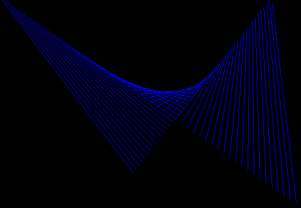



## Bouncing Lines ScreenSaver

### Description

This is a really cool ScreenSaver, it looks like a bunch of lines following eachother and bouncing off the sides of your screen. It is a clone of the windows screensaver. You can change the speed and color of the lines. Enjoy
 
### More Info
 

             |
---                |---
**Submitted On**   |
**By**             |[Adam Lane](https://github.com/Planet-Source-Code/PSCIndex/blob/master/ByAuthor/adam-lane.md)
**Level**          |Intermediate
**User Rating**    |5.0 (15 globes from 3 users)
**Compatibility**  |VB 5\.0, VB 6\.0
**Category**       |[Graphics](https://github.com/Planet-Source-Code/PSCIndex/blob/master/ByCategory/graphics__1-46.md)
**World**          |[Visual Basic](https://github.com/Planet-Source-Code/PSCIndex/blob/master/ByWorld/visual-basic.md)
**Archive File**   |

### Source Code

<b><u><small><small><small><small><small><small><small>Bouncing
Lines ScreenSaver</small></small></small></small></small></small></small><small><small><small><small><small><small><small> 
</small></small></small></small></small></small></small></u><small><small><small><small><small><small><small>by
Adam Lane</small></small> 
 
</small></small></small></small></small>

</b><small><small><small><small><small><small><small>1) Create a
</small></small></small></small></small></small></small>
<small><small><small><small><small><small><small>borderless
</small></small></small></small></small></small></small><small><small><small><small><small><small><small>form and a timer 
2) Form1 and Timer1 
3) Copy this code into your form</small></small></small></small></small></small></small><small><small><small><small><small><small><small><small><small> 
 
</small></small></small></small>Dim x(4), Y(4), xSpeed(4), ySpeed(4), Trails As Integer 
 
Private Sub Form_Load() 
&nbsp;&nbsp;&nbsp; Form1.WindowState = vbMaximized 
&nbsp;&nbsp;&nbsp; Form1.BackColor = vbBlack 
&nbsp;&nbsp;&nbsp; Form1.ForeColor = vbBlack 
&nbsp;&nbsp;&nbsp; Form1.FillColor = vbBlack 
&nbsp;&nbsp;&nbsp; Timer1.Interval = 1 
&nbsp;&nbsp;&nbsp; For i = 0 To 3 
&nbsp;&nbsp;&nbsp;&nbsp;&nbsp;&nbsp;&nbsp; x(i) = Form1.ScaleWidth \ 2 
&nbsp;&nbsp;&nbsp;&nbsp;&nbsp;&nbsp;&nbsp; Y(i) = Form1.ScaleHeight \ 2 
&nbsp;&nbsp;&nbsp; Next i 
&nbsp;&nbsp;&nbsp; xSpeed(0) = -150: xSpeed(2) = -150 
&nbsp;&nbsp;&nbsp; xSpeed(1) = 70: xSpeed(3) = 70 
&nbsp;&nbsp;&nbsp; ySpeed(0) = -105: ySpeed(2) = -105 
&nbsp;&nbsp;&nbsp; ySpeed(1) = 90: ySpeed(3) = 90 
&nbsp;&nbsp;&nbsp; Trails = 50 
End Sub 
 
Private Sub Timer1_Timer() 
&nbsp;&nbsp;&nbsp; Dim z As Integer 
&nbsp;&nbsp;&nbsp; If Trails > 0 Then 
&nbsp;&nbsp;&nbsp;&nbsp;&nbsp;&nbsp;&nbsp; Trails = Trails - 1 
&nbsp;&nbsp;&nbsp;&nbsp;&nbsp;&nbsp;&nbsp; z = 1 
&nbsp;&nbsp;&nbsp; Else 
&nbsp;&nbsp;&nbsp;&nbsp;&nbsp;&nbsp;&nbsp; z = 3 
&nbsp;&nbsp;&nbsp; End If 
&nbsp;&nbsp;&nbsp; For i = 0 To z 
&nbsp;&nbsp;&nbsp;&nbsp;&nbsp;&nbsp;&nbsp; x(i) = x(i) + xSpeed(i) 
&nbsp;&nbsp;&nbsp;&nbsp;&nbsp;&nbsp;&nbsp; Y(i) = Y(i) + ySpeed(i) 
&nbsp;&nbsp;&nbsp;&nbsp;&nbsp;&nbsp;&nbsp; If x(i) < 0 Or x(i) > Form1.ScaleWidth Then xSpeed(i) =
-xSpeed(i) 
&nbsp;&nbsp;&nbsp;&nbsp;&nbsp;&nbsp;&nbsp; If Y(i) < 0 Or Y(i) > Form1.ScaleHeight Then ySpeed(i) =
-ySpeed(i) 
&nbsp;&nbsp;&nbsp; Next i 
&nbsp;&nbsp;&nbsp; Line (x(0), Y(0))-(x(1), Y(1)), vbBlue 
&nbsp;&nbsp;&nbsp; Line (x(2), Y(2))-(x(3), Y(3)), vbBlack 
&nbsp;&nbsp;&nbsp; DoEvents 
End Sub 
</small></small></small></small></small>

